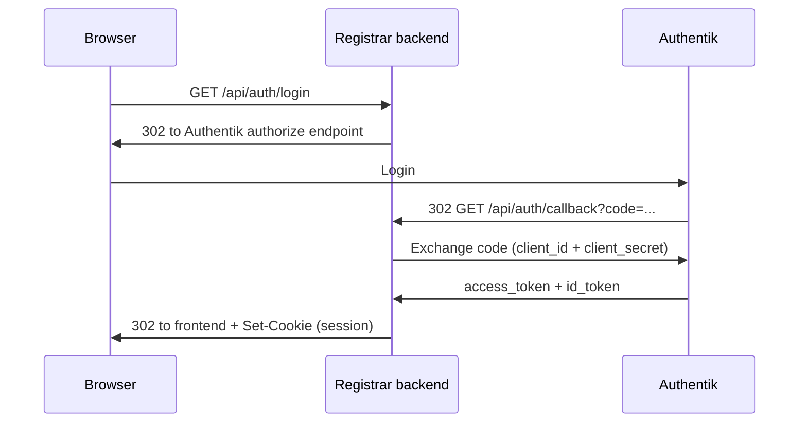

# Registrar Portal

A FastAPI + React web app representing a domain registrar's portal. It talks
to the [registry](../registry) app to look up the domains it sponsors and to
transfer domains to/from another registrar via a browser-redirect
authorization flow brokered by the registry.

## Structure

```
registrar/
├── backend/          FastAPI service (talks to the registry API)
│   ├── app/
│   │   ├── main.py            App entry point (routes, CORS, registry self-registration)
│   │   ├── models.py          Pydantic schemas
│   │   ├── auth.py            Login-session requirement (Depends)
│   │   ├── oidc.py            OIDC discovery, code exchange, ID token verification
│   │   ├── sessions.py        Server-side session store
│   │   ├── registry_client.py HTTP client for the registry API
│   │   ├── api/routes.py      /me, /domains endpoints
│   │   ├── api/auth_routes.py /auth/login, /auth/callback, /auth/session, /auth/logout
│   │   ├── api/transfer_routes.py /transfer/start, /transfer/authorize, /transfer/complete
│   │   └── core/config.py     Settings (registrar identity, registry URL, OAuth2)
│   ├── .env                   Default instance: "Registrar A" on port 8001
│   ├── .env.registrar-b       Example env for a second "Registrar B" instance
│   └── requirements.txt
├── frontend/         React + TypeScript + Vite web UI
│   └── src/
│       ├── api.ts     Typed client for the registrar backend
│       ├── auth.ts    Session check + login/logout redirects
│       └── App.tsx    UI to view sponsored domains and start a transfer
├── oauth2/           Local Authentik (OAuth2/OIDC provider) docker compose stack
└── start.sh          Starts backend + frontend together for one registrar instance
```


## Quick start

Make sure the [registry](../registry) is running first (`../registry/start.sh`).

```bash
./start.sh
```

This creates the backend virtualenv and installs frontend dependencies on
first run, then starts both the backend and frontend for a "Registrar A"
instance. Stop both with Ctrl+C.

Run a second instance with different ports and identity to simulate another
registrar, so you can transfer domains between them:

```bash
./start.sh --port 8002 --frontend-port 5175 --name "Registrar B"
```

`--registry-url` can be used to point an instance at a registry running on
a non-default port.

## How it works

Transfers use a **cross-registrar authorization-redirect flow**, similar in
spirit to OAuth2 Rich Authorization Requests (RFC 9396): the browser is
bounced directly between the gaining and losing registrar, authenticated
by a signed assertion rather than a manually-shared token.

1. Each registrar portal instance self-registers a directory entry with the
   registry on startup (`POST /api/registrars/register`): its name plus its
   own `authorize_url`. The registry only acts as a lookup directory here -
   it is never involved in relaying the transfer result.
2. To gain a domain, a signed-in user enters the domain name and clicks
   "Start transfer". This navigates the browser (not a fetch call) to this
   registrar's `GET /api/transfer/start?domain=...`.
3. That endpoint looks up the domain's current (losing) registrar from the
   registry, then looks up *that* registrar's `authorize_url` from the
   registry's directory, and redirects the browser there with:
   - `authorization_details` - a base64url-encoded JSON object naming the
     domain, e.g. `{"domain": "example.org"}`
   - `registrar` - this (gaining) registrar's name
   - `return_url` - this registrar's own `GET /api/transfer/complete` URL,
     with a correlation `state` baked in, telling the losing registrar
     exactly where to redirect once it's done
4. The losing registrar's `GET /api/transfer/authorize` endpoint requires
   the domain's current sponsor to be logged in (redirecting through
   `/auth/login` first if needed, then resuming here). Once authenticated,
   it decodes `authorization_details` and shows a consent screen naming
   the domain and requesting registrar.
5. On approval, `GET /api/transfer/decision` confirms this registrar really
   sponsors the domain, fetches its transfer token from the registry, and
   builds a **signed assertion**: an HS256 JWT containing
   `{"operation": "write:transfer", "domain": "..."}`, signed with a secret
   shared between registrar instances (`TRANSFER_SIGNING_SECRET`). It then
   redirects the browser **directly** to the `return_url` it was given,
   appending `transfer_assertion` and `transfer_token` - the registry is
   never involved in this handoff.
6. The gaining registrar's `GET /api/transfer/complete` endpoint verifies
   the assertion's signature and that its `operation`/`domain` claims match
   the pending request (correlated via `state`), then - if valid - calls
   the registry's `POST /api/domains/{name}/transfer` with the transfer
   token to actually complete the pull transfer, and redirects back to its
   frontend with a success/error message.

Starting a transfer additionally requires being logged in via OAuth2 (see
below) at both ends: once at the gaining registrar (to start the transfer)
and once at the losing registrar (to authorize it) - each registrar
instance runs its own independent login session.

## OAuth2 login

A user must log in via OAuth2/OIDC before they can start a transfer. The
registrar **backend** is a confidential OAuth2 client: it owns the client
secret and performs the Authorization Code exchange itself against
[Authentik](https://goauthentik.io/) (running locally via docker compose in
[oauth2/](oauth2)). The browser never sees the OAuth2 tokens - it only gets
an HttpOnly session cookie set by the backend after a successful login.



### 1. Start Authentik

```bash
cd oauth2
docker compose up -d
```

Wait for the containers to become healthy, then open `http://localhost:9991`
and complete the initial admin setup if you haven't already.

### 2. Create an OAuth2/OIDC provider + application

In the Authentik admin UI:

1. **Applications → Providers → Create**: type *OAuth2/OpenID Provider*.
   - Name: `registrar`
   - Client type: **Confidential**
   - Redirect URIs: add one entry per registrar backend instance you'll
     run, e.g. `http://localhost:8001/api/auth/callback` and
     `http://localhost:8002/api/auth/callback`
   - Scopes: `openid`, `email`, `profile`
   - Signing Key: pick (or generate) any available certificate
   - **Authorization flow: `default-provider-authorization-explicit-consent`**
     (important - see note below). Use explicit, not implicit, consent -
     this same application/provider is also used for normal user login
     (not just the transfer-authorization flow), so users should
     explicitly approve access rather than have it granted silently.
2. **Applications → Applications → Create**:
   - Name: `Registrar Portal`
   - Slug: `registrar` (this becomes part of the issuer URL below)
   - Provider: the one created above
3. Open the provider again and copy its **Client ID** and **Client Secret**.

> **Note - "login only works the 2nd time":** if the *Authorization flow*
> isn't set (or is set to a flow without a working consent/redirect
> stage), a user's *first* login completes authentication but then lands
> on Authentik's own dashboard instead of being redirected back to the
> registrar - because Authentik has nothing telling it to show a consent
> screen and continue the OAuth2 authorization request. On a second
> attempt it appears to work because the browser already has an Authentik
> session, so the authentication flow is skipped entirely and only the
> (correctly configured) authorization flow runs. Explicitly setting
> *Authorization flow* to `default-provider-authorization-explicit-consent`
> fixes this: the first login shows Authentik's "Authorize Application"
> consent screen (once per user), and clicking through it correctly
> continues the redirect back to the registrar.

### 3. Configure the registrar app

Set these values in `backend/.env` (and `.env.registrar-b` for a second
instance) to match what you created - `OAUTH2_CLIENT_ID`/
`OAUTH2_CLIENT_SECRET` are the same for both instances (one Authentik
application), while the redirect URI and frontend URL differ per instance:

- `OAUTH2_ISSUER`: `http://localhost:9991/application/o/registrar/`
- `OAUTH2_CLIENT_ID` / `OAUTH2_CLIENT_SECRET`: copied from the provider
- `OAUTH2_REDIRECT_URI`: this instance's own callback URL, e.g.
  `http://localhost:8001/api/auth/callback`
- `FRONTEND_URL`: this instance's frontend URL, e.g. `http://localhost:5174/`

The frontend needs no OAuth2 configuration at all - it only calls its own
backend. Restart the registrar app (`./start.sh`) after changing `.env`.

Clicking **Sign in** navigates the browser to the backend, which redirects
to Authentik, then back to the backend's `/api/auth/callback`. The backend
verifies the ID token (signature, issuer, audience) against Authentik's
JWKS, starts a server-side session, and redirects the browser back to the
frontend with a `Set-Cookie` header. `GET /api/transfer/start` and
`GET /api/transfer/authorize` both require that session cookie.

## Run the backend

Make sure the [registry backend](../registry/backend) is running first
(default `http://localhost:8000`).

```bash
cd backend
python3 -m venv .venv
source .venv/bin/activate
pip install -r requirements.txt
uvicorn app.main:app --reload --port 8001
```

- API base URL: `http://localhost:8001/api`
- Interactive docs: `http://localhost:8001/docs`
- `GET /api/me` — the registrar identity this instance represents
- `GET /api/domains` — domains currently sponsored by this registrar
- `GET /api/domains/{name}/transfer-token` — reveal a domain's transfer
  token; only allowed for domains this registrar currently sponsors
- `GET /api/auth/login` — redirects to Authentik to start a login
- `GET /api/auth/callback` — OAuth2 redirect target; exchanges the code and
  sets the session cookie
- `GET /api/auth/session` — whether the caller has an active session
- `POST /api/auth/logout` — clears the session
- `GET /api/transfer/start?domain=...` — gaining side: redirects the
  browser to the domain's current registrar to start a transfer (requires
  an active login session)
- `GET /api/transfer/authorize` — losing side: the redirect target other
  registrars send the browser to; requires an active login session, shows
  a consent screen naming the domain and requesting registrar
- `GET /api/transfer/decision` — losing side: the domain owner's
  approve/cancel decision; on approval, redirects directly to the
  `return_url` supplied by the gaining registrar with a signed
  `transfer_assertion` (HS256 JWT) and `transfer_token`
- `GET /api/transfer/complete` — gaining side: its own fixed callback URL
  (passed as `return_url` when starting the transfer); verifies the signed
  assertion, completes the actual pull transfer, and redirects to the
  frontend

### Simulating a second registrar

To demo a transfer between two registrars, run a second backend instance
using the provided example env file on a different port:

```bash
cd backend
source .venv/bin/activate
uvicorn app.main:app --reload --port 8002 --env-file .env.registrar-b
```

## Run the frontend

```bash
cd frontend
npm install
npm run dev
```

- Web UI: `http://localhost:5174`
- Configure the backend URL via `frontend/.env` (`VITE_API_URL`)

For a second registrar's UI, copy `frontend` to run on another port (e.g.
`npm run dev -- --port 5175`) with `VITE_API_URL` pointing at the second
backend instance (`http://localhost:8002/api`).
